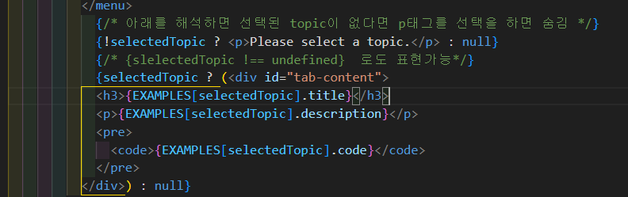
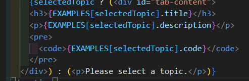
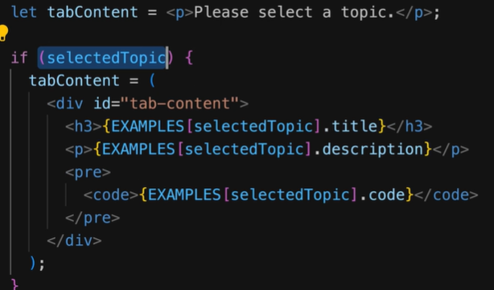
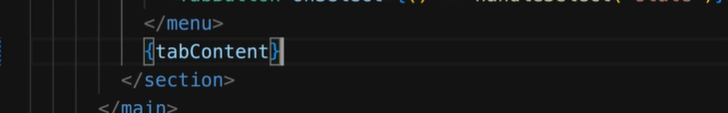
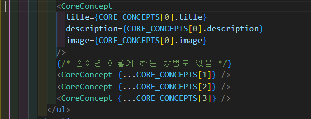
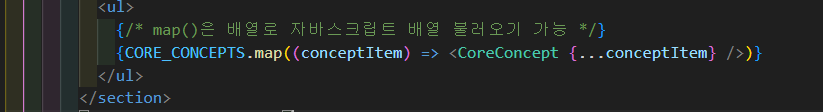

## 중첩함수에서의 Hook
  -  중첩 함수 내부에서 Hook 함수를 호출하므로 "Hook의 규칙"을 위반합니다. 고로 실행되지 않음.

## 선택되지 않았을때 보이는 페이지 / 선택 후 보이는 페이지
  - 
  이걸 더 줄여보면
  
  이렇게 줄일 수 있다.
  - 또 다른 방법은 변수를 사용하는 것인데 let으로 변수 자체를 지정 => 조건에 맞으면 덮어쓰기
  
  

## 흔히 나오는 에러
  - JSX는 하나의 상위 혹은 부모 요소를 가지고 있어야 함 즉 
태그 안에 쓰던 무슨 태그 안에 써야함.
  - 쓸데없는 div등의 태그로 감싸는걸 피하고싶으면 Fragment 또는 <> 로 감싸주면됨.
## 동적 배열
  - 
  위와같은 배열을
  
  이렇게 줄이는게 가능합니다.

# Quiz
  Q : 리액트 앱에서 State(상태)의 존재 목적은 무엇입니까?
  A : 변화가 생겼을 때 리액트가 컴포넌트를 재평가하게 하는 데이터

