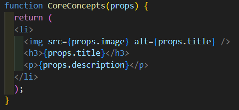
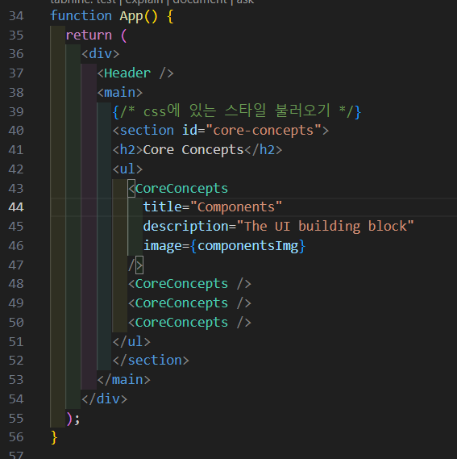
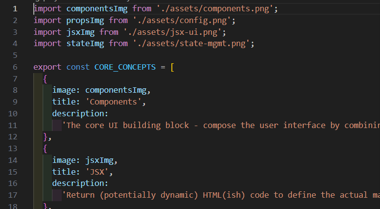
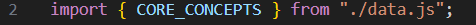

## Dynamic content
    - 리액트는 `${}`로 안하고 그냥 {}만 써도 원하는 값을 끌어 쓸 수 있음 와우!!

## 이미지 끌어오기
 - import reactImg from './assets/react-core-concepts.png' 식으로 import로 이미지 끌어오기 가능

## props
    - props는 컴포넌트의 컨셉을 정하는 것을  props라고 부름. <CoreConceptstitle="Componets" description="The UI building block" image={componentsImg}/> 와 같이 정의할때

    - props로 불러와서 사용하는 각각의 함수에 다른 내용을 주고 싶을때는 아래와 같이 사용할 곳의 변수명과 props함수의 변수명을 일치 시켜야함.
    
    

## data.js에서 불러오기
    - 아래와 같이 export로 이름이 선언된 것을 불러올 경우
    
    {}를 사용하여 import해 와서 사용해야함.
    

## .jsx컴포넌트 정리
    - 보통 폴더를 하나 파서 각각의 컴포넌트파일을 하나씩 만들어서 사용.
    - 사용할때 export default function으로 선언해서 사용해주고 불러오는곳에서 import 필수
    - 해당 jsx파일에서 사용할 .css파일은 같은 이름으로 만들어 해당 파일의 옆에 위치하게 하고 적용할 스타일을 import로 가져와서 사용한다. <주의점> 이렇게 적용한 스타일은 연결된 모든 컴포넌트에 영향을 끼치기 때문에 스타일 지정할 객체 이름이나 아이디를 입력할때 주의

## Quiz props
    Q1. JSX에서 동적인 값으로 출력될 수 있는 것은 무엇입니까? (예를 들어, 중괄호 사이)
    A. 유효한 아무 자바스크립트 표현문

    Q2. 리액트 프로젝트에서 이미지를 로딩/사용할 때 주로 사용하는 방법은 무엇입니까?
    A. src를 import문으로 생성된 path로 지정

    Q3. HTML 요소 속성에 동적인 값을 부여하는 방법은 무엇입니까?
    A. JSX에서 일반적으로 동적 값에 사용하는 것과 동일한 문법 사용

    Q4. 리액트 컴포넌트의 재사용성을 높히는 리액트의 주요 개념은 무엇입니까?
    A. props

    Q5. 리액트에서 Prop(속성)이 동작하는 방식은 무엇입니까?
    A. prop을 컴포넌트에 지정하여 전달 받는 컴포넌트에서 추출 및 사용
