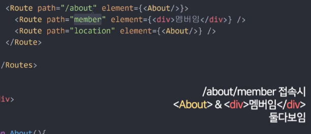
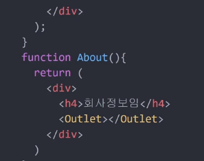

## 메모
    1. 부트스트랩 적용법
        1-1. app.js에
        import 'bootstrap/dist/css/bootstrap.min.css';
        1-2. index.html의 헤더안에
        <link
          rel="stylesheet"
          href="https://cdn.jsdelivr.net/npm/bootstrap@5.3.0/dist/css/bootstrap.min.css"
          integrity="sha384-9ndCyUaIbzAi2FUVXJi0CjmCapSmO7SnpJef0486qhLnuZ2cdeRhO02iuK6FUUVM"
          crossorigin="anonymous"
        />      
        1-2. 간격설정은 한줄 12를 기준<Col md={4}> 식으로 설정

    2. 다른 파일에 컴포넌트를 나눠서 가져올떈 export, import필수
      2-1. export default 변수 / import 작명 from '파일주소'
      2-2. 여러개를 내보낼땐 export {변수1, 변수2}, import {변수1, 변수2} from '주소'

    3. react-router-dom Route는 해당 페이지에 보여주는 화면을 나타냄
      3-1. npm install react-router-dom @6  6버전으로설지 후 npm start
      3-2. index.js 파일에서 <App>위에 <BrowserRouter> 입력
      3-3. import { BrowserRouter } from 'react-router-dom';

    4. useNavigator
      4-1. 라우터의 원리인데 추가로
      
      이렇게 사용 가능
      
      아웃렛 쪽에 멤버가 나타남
    
    5. 응답받은 함수 가져와서 사용하기 => 원하는 링크로 이동 + 반환 숫자 사용
     5-1.   let 찾은상품 = props.shoes.find(function(x){
            return x.id === id
            }) 해석 하자면 return에 맞는 함수가 function(x)에 들억가고 그 함수가 찾은상품 에 들어감.
    
    6. 스타일 컴포넌트 ($ npm install styled-components)
      6-1. css파일까지 안가고 스타일 해결 가능
      let Box = styled.div`
      background : ${(props) => props.bg};
      padding : 20px;`
      로 정의 후
      <Box bg="blue"> 식으로 사용

    7. useEffect
      7-1. 시작될떄, 코드실행할때, 종료될때 마운트 언마운트 등의 시 실행되는 코드
      import { useEffect, useState } from 'react'
      로 선언 후
      useEffect(() =>{
        // 2초가 지나면 div 제거
        const timer = setTimeout(() => {
          setAlert(false);
        }, 2000);}[이 함수에 변화가 올때마다 실행]) 식으로 사용되며

    8.axios
      8-1. 가져올땐 axios.get
       axios.get(`https://codingapple1.github.io/shop/data${btnCount}.json`)
          .then((서버에서가져온데이터) => {
            shoesPlus([...shoes, ...서버에서가져온데이터.data])
        btnClick(btnCount + 1)})
          .catch(() => {console.log('실패')})
      8-2. 내보낼땐 axios.post('/주소입력', {보낼데이터})
      8-3. 동시에 ajax요청 하기
        Promise.all([ axios.get('/url), axios.get('/url2)])
      8-4. Tip => axios는 원래 문자열만 받아올수 있는데 배열의 경우 양옆에 ""로 닫아주어 문자열로 만듬 이러한 파일 형식을 JSON이라고 함.
      8-5. fetch의 방법
        fetch('주소')
        .then(결과 => 결과.json())
        .then(data => {})

## sub2 발표
mm에서 올라온 내용 확인하기